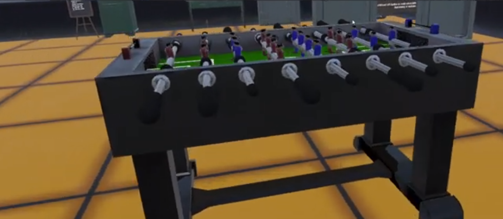
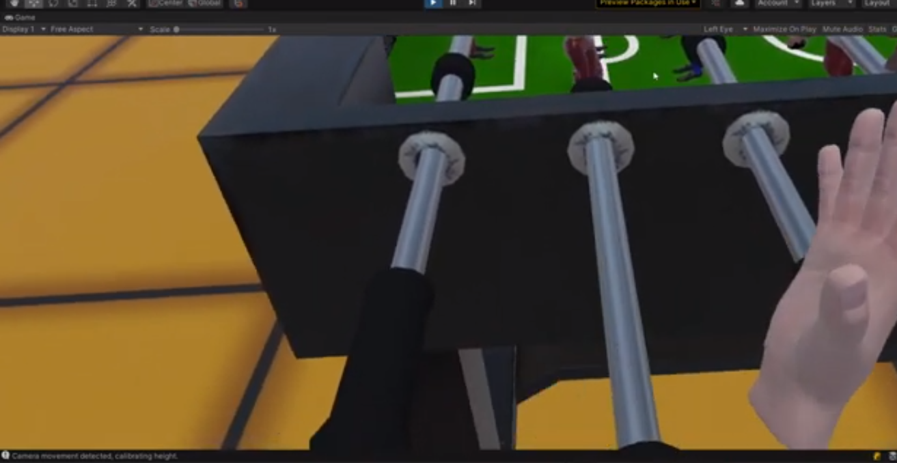

# VR Foosball

**Experience the excitement of foosball like never before with VR Foosball! Dive into the world of virtual reality and challenge your friends or AI opponents to epic foosball matches in a stunning virtual environment. Crafted with precision by FoosballVR Studio.**

## 📌 Table of Contents

1. [About the Project](#about-the-project)
2. [Game Details](#game-details)
3. [Installation](#installation)
4. [Usage](#usage)
5. [Contribution](#contribution)
6. [License](#license)
7. [Contact](#contact)
8. [Acknowledgements](#acknowledgements)

## 🎮 About the Project

VR Foosball is not just a game; it's a reimagining of the classic foosball experience in the realm of virtual reality. Prepare to be immersed in the world of foosball, where every move, kick, and save feels real. Enjoy thrilling matches and test your foosball skills in a dynamic virtual environment.

## ⚽ Game Details

### Description

- **Realistic Foosball Simulation**: Experience the thrill of foosball with lifelike ball physics and dynamic gameplay.
- **Multiplayer Action**: Challenge your friends or play against AI opponents in intense foosball matches.
- **Immersive Environments**: Engage in foosball battles in beautifully rendered virtual arenas.

### Key Features

- **360° VR Foosball**: Enjoy a complete immersion in foosball with 360° VR technology.
- **Stunning Visuals**: Feast your eyes on high-definition graphics that bring the foosball table to life.
- **Tournament Mode**: Rise through the ranks and become a foosball champion in the tournament mode.

### Gallery

## 💻 Installation

**Follow these instructions to get VR Foosball up and running:**

1. **Requirements**
   - VR headset (e.g., Oculus Rift, HTC Vive)
   - Compatible PC or gaming console
2. **Setup**
   - Download the VR Foosball installation package from the releases section.
   - Install the game following the on-screen instructions.

## 🕹️ Usage

**Here's how to get started with VR Foosball:**

1. Launch the game from your desktop or VR home.
2. Choose between single-player and multiplayer modes.
3. Challenge your friends or AI opponents to thrilling foosball matches.
4. Score goals, save shots, and become the foosball champion!

## 🤝 Contribution

We welcome contributions from foosball enthusiasts and VR gaming fans. If you'd like to contribute, please fork the repository and create a new pull request.

## 📄 License

Distributed under the XYZ License. See `LICENSE` for more information.

## 📞 Contact

Xrev Studio
- Email: contact@foosballvrstudio.com
- Twitter: [@xrevtudio](https://twitter.com/xrevVRStudio)

## 👏 Acknowledgements

- [Unity Engine](https://unity.com/)
- [SteamVR](https://developer.valvesoftware.com/wiki/SteamVR)
- [Foosball Federation](https://www.foosballfederation.com/)
